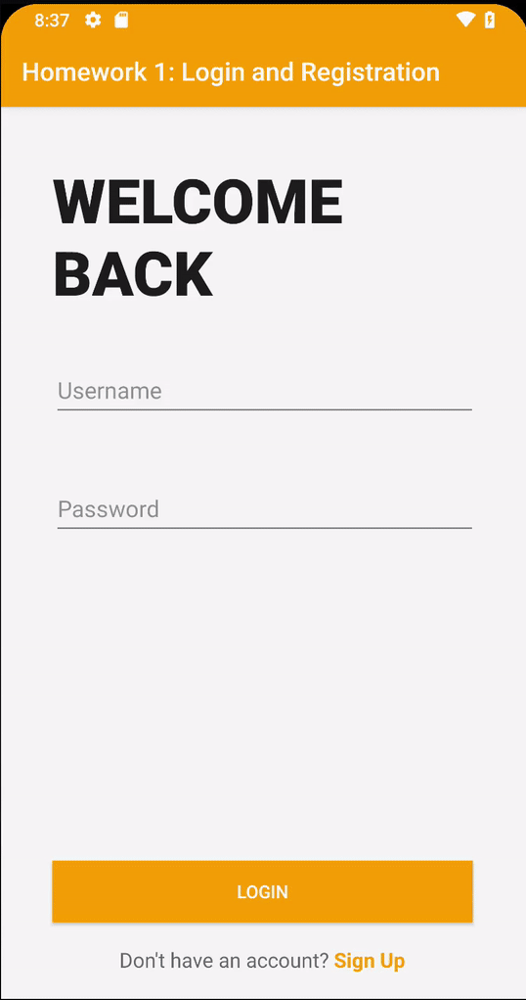

# Login  :point_right:  Register  :point_right:  Welcome :point_right: :boom:

:soon: Pass user data into welcome view 
:soon: Support different screen sizes 
:soon: Pass user data into welcome view 

## Alpha 0.2 ##

:white_check_mark: Authentication service implementation  
:white_check_mark: Authenticate logins using a database.txt file  
:white_check_mark: Register users into database.txt  
:white_check_mark: Save user data into username.txt  
:white_check_mark: Ensure no duplicate users are created using same username  
:white_check_mark: Welcome view  

## Alpha 0.1 ##

:white_check_mark: Login view  
:white_check_mark: Login inputs  
:white_check_mark: Login validation  
:white_check_mark: Login error toasts  
:white_check_mark: Registration view  
:white_check_mark: Registration inputs  
:white_check_mark: Registration Validation  
:white_check_mark: Switching between views  
